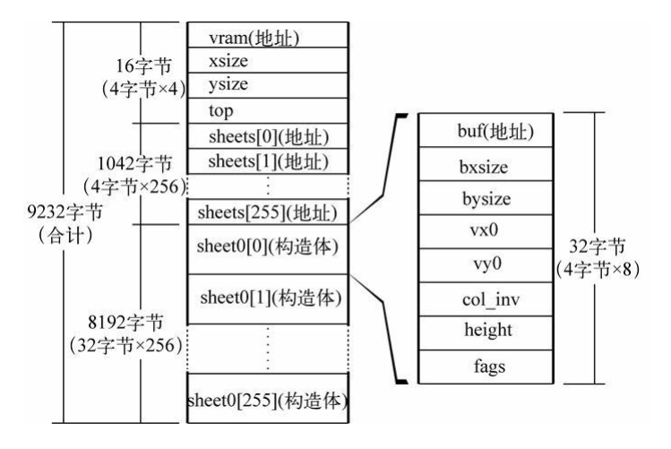
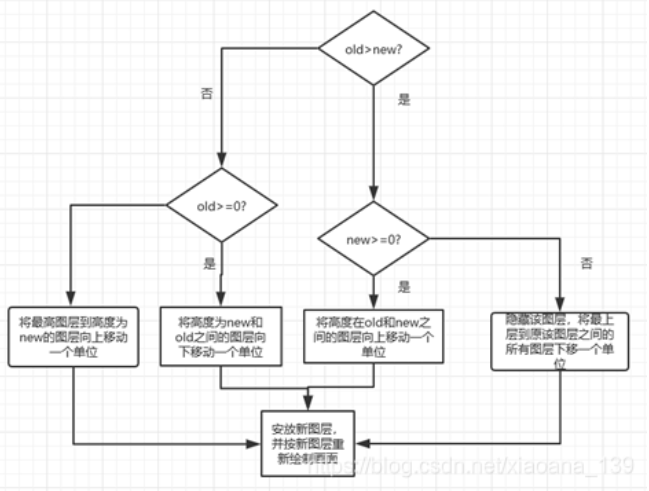
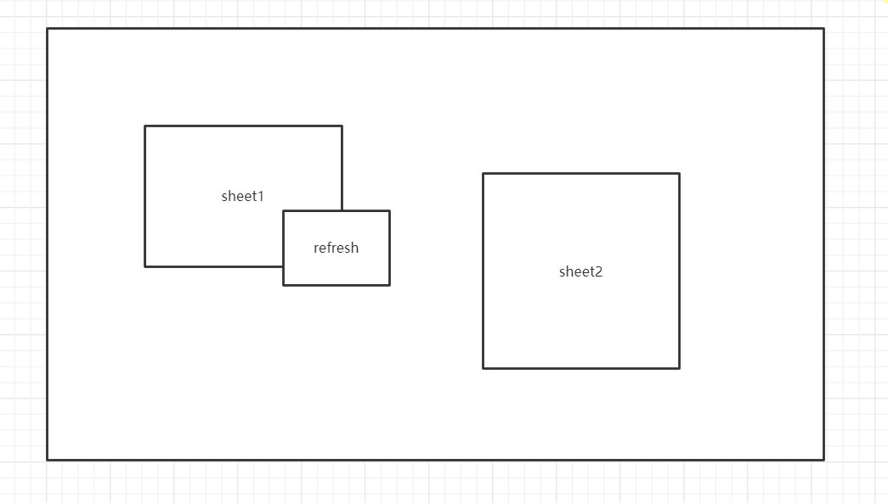
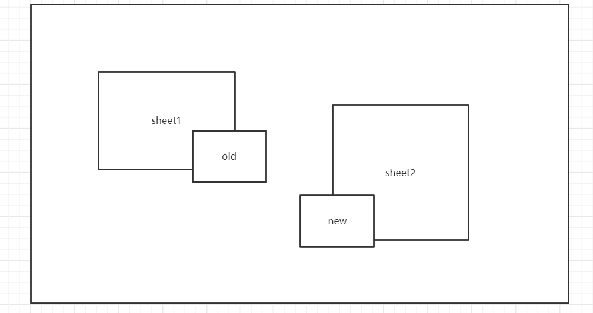

## 20220131

day1~day3


### 代码

>run.bat

````shell
copy helloos.img ..\z_tools\qemu\fdimage0.bin
# 将helloos.img 复制到qemu文件夹下，命名为fdimage0.bin
..\z_tools\make.exe	-C ../z_tools/qemu
# -C 且换目录到qemu文件夹下，并执行make命令

````

复制结束后会运行如下命令

````
qemu.exe -L . -m 32 -localtime -std-vga -fda fdimage0.bin
````

使用qemu运行该img文件

*<!-- more -->* 

> 读盘

```shell
MOV AX,0x0820
MOV ES,AX
MOV CH,0 ; 柱面0
MOV DH,0 ; 磁头0
MOV CL,2 ; 扇区2
MOV AH,0x02 ; AH=0x02 : 读盘
MOV AL,1 ; 1个扇区
MOV BX,0
MOV DL,0x00 ; A驱动器
INT 0x13 ; 调用磁盘BIOS
JC error
```

磁盘读、 写， 扇区校验（verify） ， 以及寻道（seek）
AH=0x02;（读盘）
AH=0x03;（ 写盘）
AH=0x04;（ 校验）
AH=0x0c;（ 寻道）
AL=处理对象的扇区数;（ 只能同时处理连续的扇区）
CH=柱面号 &0xff;
CL=扇区号（ 0-5位） |（ 柱面号&0x300） * * 2;
DH=磁头号;
DL=驱动器号；
ES:BX=缓冲地址； (校验及寻道时不使用)
返回值：
FLACS.CF==0： 没有错误， AH==0
FLAGS.CF==1： 有错误， 错误号码存入AH内（ 与重置（ reset）
功能一样）  

> 读入10个柱面


next: 缓冲地址加32x16 ，如果扇区号＞18，需要读入磁盘反面数据，DH+1 ,加1后如果为1 ，扇区号重置为1，读反面数据即可，如果为2 ，则需要更换柱面。


### makefile

https://blog.csdn.net/haoel/article/details/2886


*<!-- more -->* 


### 名词

>  启动区

软盘第一个的扇区称为启动区。 那么什么是扇区呢？ 计算机读写软盘的时候， 并不是一个字节一个字节地读写的， 而是以512字节为一个单位进行读写。 因此,软盘的512字节就称为一个扇区。  计算机首先从最初一个扇区开始读软盘， 然后去检查这个扇区最后2个字节的内容。  如果计算机确认了第一个扇区的最后两个字节正好是0x55 AA， 那它就认为这个扇区的开头是启动程序， 并开始执行这个程序  。

> IPL

initial program loader的缩写。 启动程序加载器。 启动区只有区区512字节， 实际的操作系统不像hello-os这么小， 根本装不进去。 所以几乎所有的操作系统， 都是把加载操作系统本身的程序放在启动区里的。  

> 汇编指令:org

指明机器语言指令装载到内存中的哪个位置

https://blog.csdn.net/soulzx/article/details/6536200

```
org指令是链接时使用的，不是汇编那一步使用的。即不是cpu的一条指令，而是给编译器看的伪指令。
```

> 汇编指令 mov A,B

将Ｂ赋值给Ａ

> 汇编指令mov A,[B]

获取B寄存器中存储的内存地址对应的数据，赋值给A


> 汇编指令HLT 

让CPU进入待机状态，当外部有输入时继续执行指令

> 汇编指令INT

 INT: interrupt

0x10  : 输出字符

0x13  : 磁盘操作(根据AH的值)

> 汇编指令JC: Jump if carry

如果进位标志(carry flag)是1 就跳转

CMP: compare

JE: jump if equal

JBE： jump if below or qual

JB : jump if below


BIOS：basic input output system


> 寄存器

AX——accumulator， 累加寄存器
CX——counter， 计数寄存器
DX——data， 数据寄存器
BX——base， 基址寄存器
SP——stack pointer， 栈指针寄存器
BP——base pointer， 基址指针寄存器
SI——source index， 源变址寄存器
DI——destination index， 目的变址寄存器  

AL——累加寄存器低位（accumulator low）
CL——计数寄存器低位（counter low）
DL——数据寄存器低位（data low）
BL——基址寄存器低位（base low）
AH——累加寄存器高位（accumulator high）
CH——计数寄存器高位（counter high）
DH——数据寄存器高位（data high）
BH——基址寄存器高位（base high）  


段寄存器(16位)

ES——附加段寄存器（extra segment）
CS——代码段寄存器（code segment）
SS——栈段寄存器（stack segment）
DS——数据段寄存器（data segment）
FS——没有名称（segment part 2）
GS——没有名称（segment part 3）  


Cylinder 柱面

Head 磁头

Sector 扇区


### 总结

一般向一个空软盘保存文件时（根据文件系统)，

1. 文件名会写在0x002600以后的地方；
2. 文件的内容会写在0x004200以后的地方。

https://blog.csdn.net/c234jc/article/details/70991050


内存分布图


## 20220201

### 操作系统流程:  

1. CPU将系统盘中第一个扇区(启动区)的内容(512Byte)加载入内存中,检验扇区最后两字节是否为0x55 ,0xAA. 如果计算机确认了第一个扇区的最后两个字节正好是0x55 AA， 那它就认为这个扇区的开头是启动程序， 并开始执行这个程序  。
2. 一个扇区是远远不够存储操作系统的，因此需要让CPU将其他扇区代码读入内存(缓冲区)中,我们要借助启动区读入的就是操作系统的代码
3. 函数是如何导入作者暂未讲解. ..

### harib00g 代码解读

> haribote.nas

```assembly
; haribote-os
; TAB=4

		ORG		0xc200	
		MOV		AL,0x13	
		MOV		AH,0x00
		INT		0x10
fin:
		HLT
		JMP		fin

```

这段是启动区运行完毕后要执行的汇编代码

~~ORG设置其加载到内存时的位置~~

ORG可以理解为偏移量，供编译器进行地址转换，

MOV		AL,0x13	
MOV		AH,0x00

 AH=0x00 ，AL=0x13设置显示为VGA图形模式

INT		0x10 调用bios函数来设置显示为VGA图形模式

后续代码进入循环

### harb00j

引入了C语言，因为C语言中没有HLT，需要用汇编实现这个函数

> naskfunc.nas和bootpack.c

```assembly
; naskfunc
; TAB=4
[FORMAT "WCOFF"] ; 制作目标文件的模式
[BITS 32] ; 制作32位模式用的机械语言
;制作目标文件的信息
[FILE "naskfunc.nas"] ; 源文件名信息
	GLOBAL _io_hlt ; 程序中包含的函数名
;以下是实际的函数
[SECTION .text] ; 目标文件中写了这些之后再写程序
_io_hlt: ; void io_hlt(void);
    HLT
    RET
```

```c
/*告诉C编译器， 有一个函数在别的文件里*/
void io_hlt(void);
/*是函数声明却不用{ }， 而用;， 这表示的意思是： 函数是在别的文件中， 你自己找一下吧！ */
void HariMain(void)
{ 
fin:
	io_hlt(); /*执行naskfunc.nas里的_io_hlt*/
	goto fin;
}
```


### harb01b

写一个HELLO

```c
void io_hlt(void);
void write_mem8(int addr, int data);


void HariMain(void)
{
	int i; 
    for (i = 0xa0000; i <= 0xaffff; i++) {
    	write_mem8(i, i & 0x0f);
    }
	WriteH(0xa0000);
	WriteE(0xa0000+7);
	WriteL(0xa0000+7*2);
	WriteL(0xa0000+7*3);
	WriteO(0xa0000+7*4);
	for (;;) {
		io_hlt();
	}
}

/*256/4 * 5*/
void WriteH(int addr){
	int i;
	for (i=0;i<=10;i++){
		write_mem8(addr+i*320,0x0f);
	}
	for (i=0;i<=10;i++){
		write_mem8(addr+5+i*320,0x0f);
	}
	write_mem8(addr+1+4*320,0x0f);
	write_mem8(addr+2+4*320,0x0f);
	write_mem8(addr+3+4*320,0x0f);
	write_mem8(addr+4+4*320,0x0f);

}
void WriteE(int addr){
	int i;
	for (i=0;i<=10;i++){
		write_mem8(addr+i*320,0x0f);
	}
	for (i=1;i<=4;i++){
		write_mem8(addr+i,0x0f);
	}
	for (i=1;i<=4;i++){
		write_mem8(addr+i+320*5,0x0f);
	}
	for (i=1;i<=4;i++){
		write_mem8(addr+i+320*10,0x0f);
	}
}
void WriteL(int addr){
	int i;
	for (i=0;i<=10;i++){
		write_mem8(addr+i*320,0x0f);
	}
	for (i=1;i<=4;i++){
		write_mem8(addr+i+320*10,0x0f);
	}
}
void WriteO(int addr){
	int i;
	for (i=0;i<=10;i++){
		write_mem8(addr+i*320,0x0f);
	}
	for (i=0;i<=10;i++){
		write_mem8(addr+5+i*320,0x0f);
	}
	for (i=1;i<=4;i++){
		write_mem8(addr+i,0x0f);
		write_mem8(addr+i+320*10,0x0f);
	}
}
```

## 20220202

### 指针

作者将指针用 地址变量来描述

char *p 定义了一个指针(即地址变量，其值为内存中的地址)

p=0x000a 即让p指向一个内存地址

往地址中写入值:

在c语言中  *p=0x123

在汇编中是 mov [EAX], 0x123

指针，其存储的值为一个地址变量 ，我们可以通过用*号去访问那个地址

& 取地址，获取变量的地址

p=(char *)&a 获取到a变量的地址，并将其转换成char类型的地址变量，赋值给p


p[1] 是什么意思:

p[1]等价于 *(p+1), 这个1并不是数值上的1 ，而是单位1 ，他根据指针的类型来决定具体的大小，char类型为1byte, short为2byte(word) ，int为4byte(DWORD)

p[1]并不代表其为数组，作者原话如下

> 不是说改变一下写法， 地址变量就变成数组了。 大家不要被那些劣质的
> 教科书骗了。 编译器生成的机器语言也完全一样。 这比什么都更能证
> 明， 意思没有变化， 只是写法不同。  
>
> 
>
> 说个题外话， 加法运算可以交换顺序， 所以将*(p + i)写成*(i + p) 也是
> 可以的。 同理， 将p[i]写成i[p]也是可以的（可能你会不相信， 但这样写
> 既不会出错， 也能正常运行） 。 a[2]也可以写成2[a]（这当然是真
> 的） 。 难道还能说这是名为2的数组的第a个元素吗？ 当然不能。 所以，
> p[i]也好， i[p]也好， 仅仅是一种省略写法， 本质上讲， 与数组没有关
> 系。  

### harib01f  色号设定

```c
void set_palette(int start, int end, unsigned char *rgb)
{
    int i, eflags;
    eflags = io_load_eflags(); /* 记录中断许可标志的值*/
    io_cli(); /* 将中断许可标志置为0， 禁止中断 */
    io_out8(0x03c8, start);
    for (i = start; i <= end; i++) {
        io_out8(0x03c9, rgb[0] / 4);
        io_out8(0x03c9, rgb[1] / 4);
        io_out8(0x03c9, rgb[2] / 4);
        rgb += 3;
	}
    io_store_eflags(eflags); /* 复原中断许可标志 */
return;
}
```

CLI ： clear interrupt flag 将中断标志置为0

STI： set interrupt flag 将中断标志置为1


读写EFLAGES  汇编指令: PUSHFD POPFD

````assembly
_io_load_eflags: ; int io_load_eflags(void);
    PUSHFD ; 指 PUSH EFLAGS
    POP EAX
    RET
_io_store_eflags: ; void io_store_eflags(int eflags);
    MOV EAX,[ESP+4]
    PUSH EAX
    POPFD ; 指 POP EFLAGS
    RET
````


## 20220203

### harib02b结构体

````c
struct BOOTINFO {
    char cyls, leds, vmode, reserve;
    short scrnx, scrny;
    char *vram;
};
void HariMain(void)
{
    char *vram;
    int xsize, ysize;
    struct BOOTINFO *binfo;
    init_palette();
    binfo = (struct BOOTINFO *) 0x0ff0;
    xsize = (*binfo).scrnx;
    ysize = (*binfo).scrny;
    vram = (*binfo).vram;
}
````

BOOTINFO 结构体存储了启动信息

在HariMain中

 binfo = (struct BOOTINFO *) 0x0ff0; 这一句用于获取在内存地址为0x0ff0的数据，由前文可知，该处内存存储了图形化界面的各种设置，分别对应了结构体中的各个变量。


### harib02d 显示字符

````c
void putfont8(char *vram, int xsize, int x, int y, char c, char *font)
{
    int i;
    char *p, d /* data */;
    for (i = 0; i < 16; i++) {
        p = vram + (y + i) * xsize + x;
        d = font[i];
        if ((d & 0x80) != 0) { p[0] = c; }
        if ((d & 0x40) != 0) { p[1] = c; }
        if ((d & 0x20) != 0) { p[2] = c; }
        if ((d & 0x10) != 0) { p[3] = c; }
        if ((d & 0x08) != 0) { p[4] = c; }
        if ((d & 0x04) != 0) { p[5] = c; }
        if ((d & 0x02) != 0) { p[6] = c; }
        if ((d & 0x01) != 0) { p[7] = c; }
    }
    return;
}

````

参数中 *vram为显存地址，xsize为显示的宽度，x,y为起始坐标，c为颜色， font为要输出的字符数组。

### harib02e 增加字体

hankaku.txt为一个记录字符的文件

其用8x16个. 和 * 记录了一些常用字符(256个)，类似如下

````shell
char 0x03
........
........
........
........
.**.**..
*******.
*******.
*******.
.*****..
..***...
...*....
........
........
........
........
........
````

使用工具makefont.exe，将其中的.和*转换成0和1 ,即用1byte代表一行，如下图所示，每一行都代表一个字符


现在这个文件仅仅是二进制文件，还不能供bootpack.obj使用，还要加上连接所必须的接口信息，将他变成目标文件

$(BIN2OBJ) hankaku.bin hankaku.obj _hankaku

类似于将如下两行程序转成汇编

_hankanku:
		DB 各种数据（共4096字节）  


C语言中要导入源程序以外准备的数据，都需要加上extern属性

extern char hankaku[4096];

这样， C编译器就能够知道它是外部数据， 并在编译时做出相应调整。


生成二进制映像文件

bootpack.bim : bootpack.obj naskfunc.obj hankaku.obj Makefile

  $(OBJ2BIM) @$(RULEFILE) out:bootpack.bim stack:3136k map:bootpack.map \

​    bootpack.obj naskfunc.obj hankaku.obj


转成hrb

bootpack.hrb : bootpack.bim Makefile

  $(BIM2HRB) bootpack.bim bootpack.hrb 0

加上头

haribote.sys : asmhead.bin bootpack.hrb Makefile

  copy /B asmhead.bin+bootpack.hrb haribote.sys


制作img文件(引入启动区程序)

haribote.img : ipl10.bin haribote.sys Makefile

  $(EDIMG)  imgin:../z_tools/fdimg0at.tek \

​    wbinimg src:ipl10.bin len:512 from:0 to:0 \

​    copy from:haribote.sys to:@: \

​    imgout:haribote.img


### harib02f 显示字符串

````c
void putfonts8_asc(char *vram, int xsize, int x, int y, char c, unsigned char *s)
{
    extern char hankaku[4096];
    for (; *s != 0x00; s++) {
        putfont8(vram, xsize, x, y, c, hankaku + *s * 16);
        x += 8;
    }
    return;
}
````

s为字符串指针，字符串以0x00作为结束


### harib02h 显示鼠标指针

> 绘制鼠标的函数

````c
void putblock8_8(char *vram, int vxsize, int pxsize,
int pysize, int px0, int py0, char *buf, int bxsize)
{
    int x, y;
    for (y = 0; y < pysize; y++) {
        for (x = 0; x < pxsize; x++) {
        	vram[(py0 + y) * vxsize + (px0 + x)] = buf[y * bxsize + x];
        }
    }
    return;
}
````

vxsize为320 ，pxsize 、pysize为要绘制图形的大小， px0 ，py0为图形的起始坐标 buf存储鼠标数据 ，bxsize类似pxsize


## 20220309

.c C语言文件 -> 汇编文件 -> 机器语言目标文件 -> 链接

 

ipl10.nas 启动区文件，用于加载操作系统到内存中。

naskfunc.nas  ，asmhead.nas    这两个用于存储汇编代码

bootpack.c  C语言函数


## 20220310

### makefile阅读，从下往上看


https://blog.csdn.net/choutou1011/article/details/100747819


> haribote.img

`````makefile
haribote.img : ipl10.bin haribote.sys Makefile

  $(EDIMG)  imgin:../z_tools/fdimg0at.tek \
 	wbinimg src:ipl10.bin len:512 from:0 to:0 \
	copy from:haribote.sys to:@: \
	imgout:haribote.img
`````


这是制作镜像文件的最后一步，

1. 输入为 ipl10.bin  haribote.sys

2. 输出为 haribote.img
3. edimg.exe: 这个是软盘镜像制作工具。
4. wbinimg 写入启动扇区的命令
5. imgin 读取指定的文件作为磁盘映像。
6. copy 将文件和文件名写入系统中


> fdimg0at.tek


> ipl10.bin

启动区文件， 通过ipl10.nas制作,操作系统会首先运行该处的代码，此处代码主要是加载后续扇区到内存中。

扇区中有代码文件，书中将扇区加载到以0x8000作为起始的内存中。

源码文件起始于img中 0x4200的位置

因此，当将扇区加载完成后，使用JMP 0xc200   跳转到源码文件的起始位置，操作系统开始执行。


> haribote.sys

源码文件，书中的代码有汇编、有C语言，需要先将其整合在一起

`````makef
haribote.sys : asmhead.bin bootpack.hrb Makefile
	copy /B asmhead.bin+bootpack.hrb haribote.sys
`````

asmhead.bin 通过目前章节只知道代码可以调用C语言程序


> bootpack.hrb

由bootpack.bim制作而成

```makefile
bootpack.hrb : bootpack.bim Makefile
	$(BIM2HRB) bootpack.bim bootpack.hrb 0
```


> bootpack.bim

`````makefile
bootpack.bim : bootpack.obj naskfunc.obj hankaku.obj Makefile
	$(OBJ2BIM) @$(RULEFILE) out:bootpack.bim stack:3136k map:bootpack.map \
		bootpack.obj naskfunc.obj hankaku.obj
`````

obj2bim 将目标文件合成为bim文件


> hakaku

hankaku.bin : hankaku.txt Makefile

  $(MAKEFONT) hankaku.txt hankaku.bin


hankaku.obj : hankaku.bin Makefile

  $(BIN2OBJ) hankaku.bin hankaku.obj _hankaku


## 20220311


### harib02i GDT和IDT的初始化

> 分段 segmentation

按照自己喜欢的方式， 将合计4GB的内存分成很多块（block） ， 每一块的起始地址都看作来0处理。

 为了了表示一个段， 需要有以下信息。

1. 段的大小是多少
2. 段的起始地址在哪里
3. 段的管理属性（禁止写入， 禁止执行， 系统专用等）  

> 段号(segment selector 段选择符) 与GDT(global (segment) descriptor table 全局段号记录表)

CPU需要用8个字节存储这些信息，但段寄存器只有16位(由于CPU设计的原因，低三位不能使用)，因此段寄存器只能存储段号, 再由段号映射到存在内存中的GDT（global (segment) descriptor table，全局段号记录表），读取段的信息。


段寄存器有16位，三位不能使用，所以段号范围为0~8191即可以定义8192个段，每个段需要8字节来定义，一共需要64kb 即GDT大小为64KB


> IDT (interrupt descriptor table 中断记录表)

当CPU遇到外部状况变化， 或者是内部偶然发生某些错误时， 会临时切换过去处理这种突发事件。 这就是中断功能 。

各个设备有变化时就产生中断， 中断发生后， CPU暂时停止正在处理的任务， 并做好接下来能够继续处理的准备， 转而执行中断程序。 中断程序执行完以后， 再调用事先设定好的函数， 返回处理中的任务。 正是得益于中断机制， CPU可以不用一直查询键盘， 鼠标， 网卡等设备的状态， 将精力集中在处理任务上。

IDT，Interrupt Descriptor Table，即中断描述符表，和GDT类似，他记录了0~255的中断号和调用函数之间的关系。

  

关于IDT和GDT的详细介绍

https://blog.csdn.net/ice__snow/article/details/50654629

https://blog.csdn.net/cwcmcw/article/details/21640363

GDT可以被放在内存的任何位置，那么当程序员通过段寄存器来引用一个段描述符时，CPU必须知道GDT的入口，也就是基地址放在哪里，所以Intel的设计者门提供了一个寄存器GDTR用来存放GDT的入口地址，程序员将GDT设定在内存中某个位置之后，可以通过LGDT指令将GDT的入口地址装入此寄存器，从此以后，CPU就根据此寄存器中的内容作为GDT的入口来访问GDT了。


> 新增代码

char *p; /*用于BYTE类地址*/
short *p; /*用于WORD类地址*/
int *p; /*用于DWORD类地址*/  

````C
struct SEGMENT_DESCRIPTOR{ 
    short limit_low, base_low;
    char base_mid, access_right;
    char limit_high, base_high;
}; //存放GDT每个段的8字节信息2+2+1+1+1+1
struct GATE_DESCRIPTOR {
    short offset_low, selector;
    char dw_count, access_right;short offset_high;
}; //存放IDT信息
void init_gdtidt(void)//GDT初始化
{
    struct SEGMENT_DESCRIPTOR *gdt = (struct SEGMENT_DESCRIPTOR *) 0x00270000;
    struct GATE_DESCRIPTOR *idt = (struct GATE_DESCRIPTOR *) 0x0026f800;
    int i;
    /* GDT的初始化 
    	GDT里面的值都为0
    */
    for (i = 0; i < 8192; i++) {
    	set_segmdesc(gdt + i, 0, 0, 0);
    }
    /*
    	程序使用了两个段
    */
    set_segmdesc(gdt + 1, 0xffffffff, 0x00000000, 0x4092);
    set_segmdesc(gdt + 2, 0x0007ffff, 0x00280000, 0x409a);
    load_gdtr(0xffff, 0x00270000);
    /* IDT的初始化 */
    for (i = 0; i < 256; i++) {
    	set_gatedesc(idt + i, 0, 0, 0);
    }
    load_idtr(0x7ff, 0x0026f800);
    return;
} 
void set_segmdesc(struct SEGMENT_DESCRIPTOR *sd, unsigned int limit, int base,int ar)
{
    if (limit > 0xfffff) {
        ar |= 0x8000; /* G_bit = 1 */
        limit /= 0x1000;
    }
    sd->limit_low = limit & 0xffff;
    sd->base_low = base & 0xffff;
    sd->base_mid = (base >> 16) & 0xff;
    sd->access_right = ar & 0xff;
    sd->limit_high = ((limit >> 16) & 0x0f) | ((ar >> 8) & 0xf0);
    sd->base_high = (base >> 24) & 0xff;
    return;
} 
void set_gatedesc(struct GATE_DESCRIPTOR *gd, int offset, int selector, int ar)
{
    gd->offset_low = offset & 0xffff;
    gd->selector = selector;
    gd->dw_count = (ar >> 8) & 0xff;
    gd->access_right = ar & 0xff;
    gd->offset_high = (offset >> 16) & 0xffff;
    return;
}
````


 也就是说将0x270000~0x27ffff 设为GDT

struct SEGMENT_DESCRIPTOR *gdt = (struct SEGMENT_DESCRIPTOR *) 0x00270000;


将0x26f800~0x27ffff设为IDT

  struct GATE_DESCRIPTOR *idt = (struct GATE_DESCRIPTOR *) 0x0026f800; 


将所有段的上限（limit, 指段的字节数-1） 、 基址（base） 、 访问权限都设为0  

for (i = 0; i < 8192; i++) {
	set_segmdesc(gdt + i, 0, 0, 0);
}   


段号为0 的段，上限值为0xffffffff（4GB)、 地址为0，标识CPU所能管理的内存本身，段属性为0x4092

set_segmdesc(gdt + 1, 0xffffffff, 0x00000000, 0x4092);

段号为1 的段，上限值为0x0007ffff（521KB)、 地址为0x00280000，标识CPU所能管理的内存本身，

这正好是为bootpack.hrb而准备的(具体可以查看后面介绍的asmhead.nas)。 用这个段， 就可以执行bootpack.hrb。 因为bootpack.hrb是以ORG 0为前提翻译成的机器语言。  

set_segmdesc(gdt + 2, 0x0007ffff, 0x00280000, 0x409a)  


### harib03a  分割文件


makefile优化

`````makefile
bootpack.gas : bootpack.c Makefile
$(CC1) -o bootpack.gas bootpack.c
graphic.gas : graphic.c Makefile
$(CC1) -o graphic.gas graphic.c
dsctbl.gas : dsctbl.c Makefile
$(CC1) -o dsctbl.gas dsctbl.c
或者像这样：
bootpack.nas : bootpack.gas Makefile
$(GAS2NASK) bootpack.gas bootpack.nas
graphic.nas : graphic.gas Makefile
$(GAS2NASK) graphic.gas graphic.nas
dsctbl.nas : dsctbl.gas Makefile
$(GAS2NASK) dsctbl.gas dsctbl.nas
`````

可以使用下面规则来取代

`````makefile
%.gas : %.c Makefile
$(CC1) -o $*.gas $*.c
%.nas : %.gas Makefile
$(GAS2NASK) $*.gas $*.nas
`````

而且不用考虑冲突问题，makefilemake.exe会首先寻找普通的生成规则， 如果没找到， 就尝试用一般规则。


> LGDT

GDT可以被放在内存的任何位置，那么当程序员通过段寄存器来引用一个段描述符时，CPU必须知道GDT的入口，也就是基地址放在哪里，所以Intel的设计者门提供了一个寄存器GDTR用来存放GDT的入口地址，程序员将GDT设定在内存中某个位置之后，可以通过LGDT指令将GDT的入口地址装入此寄存器，从此以后，CPU就根据此寄存器中的内容作为GDT的入口来访问GDT了。

`````assembly
_load_gdtr: ; void load_gdtr(int limit, int addr);
MOV AX,[ESP+4] ; limit
MOV [ESP+6],AX
LGDT [ESP+6]
RET
`````

GDTR  这一特殊的寄存器为48位， 不能通过mov直接赋值。而是通过LGDT 指令，将指定地址处6个字节读入寄存器中。

该寄存器低16位为段上限，它等于“GDT的有效字节数 - 1”。  

剩下32位为GDT在内存中的开始地址。


在最初执行这个函数的时候， DWORD[ESP + 4]里存放的是段上限，DWORD[ESP+8]里存放的是地址。   

load_gdtr(0xffff, 0x00270000);

在内存分布为[ff ff 00 00  00 00 27 00]

而我们想要读取的是六个字节 ，即 [ff ff 00 00 27 00]

在该函数中，首先 向AX 存储[ ff ff ]

然后将其存入ESP+6处，此时内存分布为 [ff ff ff ff 00 00 27 00]

此时从ESP+6读取，正好为[ff ff 00 00 27 00]


### 填写段信息set_segmdesc  

````c
struct SEGMENT_DESCRIPTOR {
    short limit_low, base_low;
    char base_mid, access_right;
    char limit_high, base_high;
};
void set_segmdesc(struct SEGMENT_DESCRIPTOR *sd, unsigned int limit, int base,
int ar)
{
    if (limit > 0xfffff) {
        ar |= 0x8000; /* G_bit = 1 */
        limit /= 0x1000;
    }
    sd->limit_low = limit & 0xffff;
    sd->base_low = base & 0xffff;
    sd->base_mid = (base >> 16) & 0xff;
    sd->access_right = ar & 0xff;
    sd->limit_high = ((limit >> 16) & 0x0f) | ((ar >> 8) & 0xf0);
    sd->base_high = (base >> 24) & 0xff;
    return;
}
````

这个函数是按照CPU的规格要求， 将段的信息归结成8个字节写入内存的。   

注: limit_high 高四位用于存储段信息，因此段上限可使用的位数为20位


包含如下信息

- 段的起始位置 (base)
- 段的大小(limit)
- 段的管理属性（禁止写入， 禁止执行， 系统专用等） (ar)

### 基址base

基址在结构中分成了三部分，共32位

为什么要分为3段呢？ 主要是为了与80286时代的程序兼容。 有了这样的
规格， 80286用的操作系统， 也可以不用修改就在386以后的CPU上运行
了  


### 段上限limit

表示一个段有多少个字节，但在32位系统中，段上限最大是4GB，是一个32位的数字。

然而在结构体中，存储段上限的仅有20位，最大上限也只能是1mb

在这里英特尔的叔叔们又想了一个办法， 他们在段的属性里设了一个标志位， 叫做Gbit。 这个标志位是1的时候， limit的单位不解释成字节（byte） ， 而解释成页（page） 。 页是什么呢？ 在电脑的
CPU里， 1页是指4KB。  

​	

### 段属性

12位，段属性又称为“段的访问权属性”， 在程序中用变量名access_right或ar来表示。 因为12位段属性中的高4位放在limit_high的高4位里， 所以程序里有意把ar当作如下的16位构成来处理：
xxxx0000xxxxxxxx(其中x是0或1)  

ar的高4位被称为“扩展访问权”。  

由“GD00”构成的， 其中G是指刚才所说的G bit， D是指段的模式， 1是指32位模式， 0是指16位模式  


ar的低四位

00000000（0x00） ： 未使用的记录表（descriptor table） 。
10010010（0x92） ： 系统专用， 可读写的段。 不可执行。
10011010（0x9a） ： 系统专用， 可执行的段。 可读不可写。
11110010（0xf2） ： 应用程序用， 可读写的段。 不可执行。
11111010（0xfa） ： 应用程序用， 可执行的段。 可读不可写。  

在32位模式下， CPU有系统模式（也称为“ring0”3） 和应用模式（也称为“ring3”） 之分。 操作系统等“管理用”的程序， 和应用程序等“被管理”的程序， 运行时的模式是不同的。  

CPU到底是处于系统模式还是应用模式， 取决于执行中的应用程序是位
于访问权为0x9a的段， 还是位于访问权为0xfa的段。  


### 初始化PIC(harib03d)

PIC programmable interrupt controller  可编程中断控制器。

PIC是将8个中断信号1集合成一个中断信号的装置。 PIC监视着输入管脚的8个中断信号， 只要有一个中断信号进来， 就将唯一的输出管脚信号变成ON， 并通知给CPU  

IBM的大叔们想要通过增加PIC来处理更多的中断信号， 他们认为电脑会有8个以上的外部设备， 所以就把中断信号设计成了15个， 并为此增设了2个PIC。  


中断请求，interrupt request， 缩写为IRQ。  

`````c
int.c的主要组成部分
void init_pic(void)
/* PIC的初始化 */
{
    io_out8(PIC0_IMR, 0xff ); /* 禁止所有中断 */
    io_out8(PIC1_IMR, 0xff ); /* 禁止所有中断 */
    
    io_out8(PIC0_ICW1, 0x11 ); /* 边沿触发模式（edge trigger mode） */
    io_out8(PIC0_ICW2, 0x20 ); /* IRQ0-7由INT20-27接收 */
    io_out8(PIC0_ICW3, 1 << 2); /* PIC1由IRQ2连接 */
    io_out8(PIC0_ICW4, 0x01 ); /* 无缓冲区模式 */
    
    io_out8(PIC1_ICW1, 0x11 ); /* 边沿触发模式（edge trigger mode） */
    io_out8(PIC1_ICW2, 0x28 ); /* IRQ8-15由INT28-2f接收 */
    io_out8(PIC1_ICW3, 2 ); /* PIC1由IRQ2连接 */
    io_out8(PIC1_ICW4, 0x01 ); /* 无缓冲区模式 */
    io_out8(PIC0_IMR, 0xfb ); /* 11111011 PIC1以外全部禁止 */
    io_out8(PIC1_IMR, 0xff ); /* 11111111 禁止所有中断 */
    return;
}
`````


io_out函数用于向指定外部装置传送数据

为了区别不同的设备， 也要使用设备号码。 设备号码在英文中称为port（端口） ，这些号码并不是随意取的。

程序中的PIC0和PIC1， 分别指主PIC和从PIC。  PIC内部有很多寄存器， 用端口号码对彼此进行区别， 以决定是写入哪一个寄存器。  

具体的端口号码写在bootpack.h里， 请参考这个程序。 但是， 端口号相同的东西有很多， 可能会让人觉得混乱。  (有时候向要向一个端口写入多次数据，每次数据代表的操作不同)

### PIC寄存器

PIC 寄存器都是8位寄存器

> ​	IMR寄存器

IMR是“interrupt mask register”的缩写， 意思是“中断屏蔽寄存器”。 8位分别对应8路IRQ信号。 如果某一位的值是1， 则该位所对应的IRQ信号被屏蔽， PIC就忽视该路信号。  

> ICW寄存器

ICW是“initial control word”的缩写， 意为“初始化控制数据”。  

ICW有4个， 分别编号为1~4， 共有4个字节的数据。   

ICW1和ICW4与PIC主板配线方式、 中断信号的电气特性等有关  


ICW3是有关主—从连接的设定， 对主PIC而言， 第几号IRQ与从PIC相连， 是用8位来设定的。 如果把这些位全部设为1， 那么主PIC就能驱动8个从PIC（那样的话， 最大就可能有64个IRQ） ， 但我们所用的电脑并不是这样的， 所以就设定成00000100。（表示IRQ2与从PIC连接)   

ICW2 决定了IRQ以哪一号中断通知CPU。   

中断发生以后， 如果CPU可以受理这个中断， CPU就会命令PIC发送2个字节的数据。 这2个字节是怎么传送的呢？ CPU与PIC用IN或OUT进行数据传送时， 有数据信号线连在一起。 PIC就是利用这个信号线发送这2个字节数据的。 送过来的数据是“0xcd 0x??”这两个字节。 由于电路设计的原因， 这两个字节的数据在CPU看来， 与从内存读进来的程序是完全一样的， 所以CPU就把送过来的“0xcd 0x??”作为机器语言执行。 这恰恰就是把数据当作程序来执行的情况。 这里的0xcd就是调用BIOS时使用的那个INT指令。 我们在程序里写的“INT 0x10”， 最后就被编译成了“0xcd 0x10”。 所以， CPU上了PIC的当， 按照PIC所希望的中断号执行了INT指令。  

中断处理

https://blog.csdn.net/weixin_42240667/article/details/105071373


### 中断处理程序


``````c
void inthandler21(int *esp)
/* 来自PS/2键盘的中断 */
{
struct BOOTINFO *binfo = (struct BOOTINFO *) ADR_BOOTINFO;
boxfill8(binfo->vram, binfo->scrnx, COL8_000000, 0, 0, 32 * 8 - 1, 15);
putfonts8_asc(binfo->vram, binfo->scrnx, 0, 0, COL8_FFFFFF, "INT 21 (IRQ-1) :
PS/2 keyboard");
for (;;) {
io_hlt();
}
}
``````

中断处理完成之后， 不能执行“return;”（=RET指令） ， 而是必须执行IRETD指令  

这里使用汇编实现

```assembly
EXTERN _inthandler21, _inthandler2c
_asm_inthandler21:
    PUSH ES
    PUSH DS
    PUSHAD
    MOV EAX,ESP
    PUSH EAX
    MOV AX,SS
    MOV DS,AX
    MOV ES,AX
    CALL _inthandler21
    POP EAX
    POPAD
    POP DS
    POP ES
    IRETD
```

这个函数只是将寄存器的值保存到栈里， 然后将DS和ES调整到与SS相等， 再调用_inthandler21， 返回以后， 将所有寄存器的值再返回到原来的值， 然后执行IRETD。 内容就这些。 如此小心翼翼地保存寄存器的值， 其原因在于， 中断处理发生在函数处理的途中， 通过IREDT从中断处理返回以后， 如果寄存器的值乱了， 函数就无法正常处理下去了， 所以一定要想尽办法让寄存器的值返回到中断处理前的状态。  


PUSHAD， 它相当于：
PUSH EAX
PUSH ECX
PUSH EDX
PUSH EBX
PUSH ESP
PUSH EBP
PUSH ESI
PUSH EDI
反过来， POPAD指令相当于按以上相反的顺序， 把它们全都POP出来  

>  RET和IRET

 RET 子程序的返回指令

iret     interrupt return 　　中断返回指令


函数中的数字以INT 0x20~0x2f接收中断信号IRQ0~15而设定的。  (INT 0x00~0x1f不能用于IRQ  )


### 将中断处理程序注册到IDT中

在dsctbl.c的init_gdtidt里加入以下语句  

`````c
/* IDT的设定 */
set_gatedesc(idt + 0x21, (int) asm_inthandler21, 2 * 8, AR_INTGATE32);
set_gatedesc(idt + 0x2c, (int) asm_inthandler2c, 2 * 8, AR_INTGATE32);
`````

asm_inthandler21注册在idt的第0x21号。 这样， 如果发生中断了， CPU就会自动调用asm_inthandler21。 这里的2 * 8表示的是asm_inthandler21属于哪一个段， 即段号是2， 乘以8是因为低3位有着别的意思， 这里低3位必须是0。


CLI汇编指令全称为Clear Interupt，该指令的作用是禁止中断发生，在CLI起效之后，所有外部中断都被屏蔽，这样可以保证当前运行的代码不被打断，起到保护代码运行的作用。

STI汇编指令全称为Set Interupt，该指令的作用是允许中断发生，在STI起效之后，所有外部中断都被恢复，这样可以打破被保护代码的运行，允许硬件中断转而处理中断的作用。

  

## 20220318

### 获取键盘按键信息harib04a

````c
#define PORT_KEYDAT 0x0060
void inthandler21(int *esp)
{
    struct BOOTINFO *binfo = (struct BOOTINFO *) ADR_BOOTINFO;
    unsigned char data, s[4];
    io_out8(PIC0_OCW2, 0x61); /* 通知PIC"IRQ-01已经受理完毕" */
    data = io_in8(PORT_KEYDAT);
    sprintf(s, "%02X", data);
    boxfill8(binfo->vram, binfo->scrnx, COL8_008484, 0, 16, 15, 31);
    putfonts8_asc(binfo->vram, binfo->scrnx, 0, 16, COL8_FFFFFF, s);
    return;
}
````

通知中断已完成:  将“0x60+IRQ号码”输出给OCW2


1. 通知PIC"IRQ-01已经受理完毕
2. PIC继续时刻监视IRQ1中断是否发生。  
3. 0x0060 设备为键盘设备，从中读取8bit数据
4. 键盘的按下和松开都会产生中断


### 加快中断处理（hiarib04b）  


字符显示的内容被放在了中断处理程序中。  中断处理进行期间， 不再接受别的中断。 所以如果处理键盘的中断速度太慢， 就会出现鼠标的运动不连贯、不能从网上接收数据等情况， 这都是我们不希望看到的。  

解决方法

> 中断处理程序中，只对中断以及数据进行记录，如果有中断，该程序只存储该数据，并将flag置为1

`````c
struct KEYBUF {
unsigned char data, flag;
};
#define PORT_KEYDAT 0x0060
struct KEYBUF keybuf;
void inthandler21(int *esp)
{
unsigned char data;
io_out8(PIC0_OCW2, 0x61); /* 通知PIC IRQ-01已经受理完毕 */
data = io_in8(PORT_KEYDAT);if (keybuf.flag == 0) {
keybuf.data = data;
keybuf.flag = 1;
}return;
}
`````


> 主程序只要偶尔检测flag的值，如果为1，则进行进一步键盘处理

`````c
for (;;) {
    io_cli(); //先关中断
    if (keybuf.flag == 0) {//没有键盘按下
        io_stihlt();//连续指定STI 和HLT
    } else {
        i = keybuf.data;
        keybuf.flag = 0;
        io_sti();//获取完数据后打开中断。
        sprintf(s, "%02X", i);
        boxfill8(binfo->vram, binfo->scrnx, COL8_008484, 0, 16, 15, 31);
        putfonts8_asc(binfo->vram, binfo->scrnx, 0, 16, COL8_FFFFFF, s);
    }
}
`````

HLT; 使CPU进入等待状态

CLI汇编指令全称为Clear Interupt，该指令的作用是禁止中断发生，在CLI起效之后，所有外部中断都被屏蔽，这样可以保证当前运行的代码不被打断，起到保护代码运行的作用。

STI汇编指令全称为Set Interupt，该指令的作用是允许中断发生，在STI起效之后，所有外部中断都被恢复，这样可以打破被保护代码的运行，允许硬件中断转而处理中断的作用。

**根据CPU的规范， 机器语言的STI指令之后， 如果紧跟着HLT指令， 那么就暂不受理这两条指令之间的中断， 而要等到HLT指令之后才受理**  


> 按住ctrl
>
> 当按下右Ctrl键时， 会产生两个字节的键码值“E0
> 1D”， 而松开这个键之后， 会产生两个字节的键码值“E0 9D”。 在一次产
> 生两个字节键码值的情况下， 因为键盘内部电路一次只能发送一个字
> 节， 所以一次按键就会产生两次中断， 第一次中断时发送E0， 第二次中
> 断时发送1D。  

### fifo缓冲区

> version1

中断函数

```c

struct KEYBUF {
unsigned char data[32];
int next;
};
void inthandler21(int *esp)
{
    unsigned char data;
    io_out8(PIC0_OCW2, 0x61); /* 通知PIC IRQ-01已经受理完毕 */
    data = io_in8(PORT_KEYDAT);
    if (keybuf.next < 32) {
    keybuf.data[keybuf.next] = data;
    keybuf.next++;}
    return;
}
```

主函数

```c
for (;;) {
    io_cli();
    if (keybuf.next == 0) {
    	io_stihlt();
    } else {
        i = keybuf.data[0];
        keybuf.next--;
    for (j = 0; j < keybuf.next; j++) {
    	keybuf.data[j] = keybuf.data[j + 1];
    }
    io_sti();
    sprintf(s, "%02X", i);
    boxfill8(binfo->vram, binfo->scrnx, COL8_008484, 0, 16, 15, 31);
    putfonts8_asc(binfo->vram, binfo->scrnx, 0, 16, COL8_FFFFFF, s);
	}
}
```

中断函数: 每次中断都会将数据存入数组中，并记录下一次存放的位置

主函数：如果flag=1  读取数组中第一个数据，将后续数据往前移一个位置 keybuf.next也-1


该函数主要问题在主函数中，最多要移动31个数据，在性能上有很大缺失。


> version2

不仅要维护下一个要写入数据的位置， 还要维护下一个要读出数据的位置。  

当读和写位置一样时，没有数据需要处理，

```c
struct KEYBUF {
    unsigned char data[32];
    int next_r, next_w, len;
};
变量len是指缓冲区能记录多少字节的数据。
    
    
void inthandler21(int *esp)
{
    unsigned char data;
    io_out8(PIC0_OCW2, 0x61); /* 通知 IRQ-01已经受理完毕 */
    data = io_in8(PORT_KEYDAT);
    if (keybuf.len < 32) { //如果keybuf还有空余位置
        keybuf.data[keybuf.next_w] = data;
        keybuf.len++;
        keybuf.next_w++;
        if (keybuf.next_w == 32) {
            keybuf.next_w = 0;
        }
    }
    return;
}


for (;;) {
io_cli();
    if (keybuf.len == 0) { 
        	io_stihlt();
        } else {//len记录存放的数据的多少
            i = keybuf.data[keybuf.next_r];
            keybuf.len--;
            keybuf.next_r++;
            if (keybuf.next_r == 32) {
            	keybuf.next_r = 0;
            }
            io_sti();
    }
}
```


### 鼠标（harib04f）  

鼠标传送的信息较多，在一开的时候并不适合操作系统

所以， 虽然在主板上做了鼠标用的电路， 但只要不执行激活鼠标的指令，就不产生鼠标的中断信号  

要想让鼠标能够传送数据、产生中断信号

1. 激活鼠标控制电路
2. 激活鼠标本身

> 控制电路的设定  

鼠标控制电路包含在键盘控制电路里， 如果键盘控制电路的初始化正常完成， 鼠标电路控制器的激活也就完成了  

```c
#define PORT_KEYDAT 0x0060
#define PORT_KEYSTA 0x0064
#define PORT_KEYCMD 0x0064
#define KEYSTA_SEND_NOTREADY 0x02
#define KEYCMD_WRITE_MODE 0x60
#define KBC_MODE 0x47

    /*它的作用是， 让键盘控制电路（keyboard controller, KBC） 做好准备动作， 等待控制指令的到来。*/
void wait_KBC_sendready(void)
{
    /* 等待键盘控制电路准备完毕 */
    for (;;) {
        if ((io_in8(PORT_KEYSTA) & KEYSTA_SEND_NOTREADY) == 0) {
        	break;
        }
    }
    return;
} 
 /*如果键盘控制电路可以接受CPU指令了， CPU从设备号码0x0064处所读取的数据的倒数第二位（从低位开始数的第二位） 应该是0。 在确认到这一位是0之前， 程序一直通过for语句循环查询。*/

    
void init_keyboard(void)
{
    /* 初始化键盘控制电路 */
    wait_KBC_sendready();
    io_out8(PORT_KEYCMD, KEYCMD_WRITE_MODE); //进行模式设定
    wait_KBC_sendready();
    io_out8(PORT_KEYDAT, KBC_MODE);  //利用鼠标模式
    return;
}
```


> 鼠标设定

现在， 我们开始发送激活鼠标的指令。 所谓发送鼠标激活指令， 归根到底还是要向键盘控制器发送指令  

```c
#define KEYCMD_SENDTO_MOUSE 0xd4
#define MOUSECMD_ENABLE 0xf4
void enable_mouse(void)
{
    /* 激活鼠标 */
    wait_KBC_sendready();
    /*往键盘控制电路发送指令0xd4， 下一个数据就会自动发送给鼠标。 */
    io_out8(PORT_KEYCMD, KEYCMD_SENDTO_MOUSE);
    wait_KBC_sendready();
    /*激活鼠标*/
    io_out8(PORT_KEYDAT, MOUSECMD_ENABLE);
    return; /* 顺利的话,键盘控制其会返送回ACK(0xfa)*/
}
```


### 从鼠标接受数据（harib04g）  


> 中断函数

```C
struct FIFO8 mousefifo;
void inthandler2c(int *esp)
/* 来自PS/2鼠标的中断 */
{
    unsigned char data;
    io_out8(PIC1_OCW2, 0x64); /* 通知PIC1 IRQ-12的受理已经完成 */
    io_out8(PIC0_OCW2, 0x62); /* 通知PIC0 IRQ-02的受理已经完成 */
    data = io_in8(PORT_KEYDAT);
    fifo8_put(&mousefifo, data);
    return;
}
```

因为鼠标位于从PIC ，因此首先需要通知PIC1  ，鼠标的中断受理完成，

然后通知主PIC，从PIC终端受理完成。

> 主函数

```c
fifo8_init(&mousefifo, 128, mousebuf);
for (;;) {
    io_cli();
    if (fifo8_status(&keyfifo) + fifo8_status(&mousefifo) == 0) {
        io_stihlt();
    } else {
        if (fifo8_status(&keyfifo) != 0) {
            i = fifo8_get(&keyfifo);
            io_sti();
            sprintf(s, "%02X", i);
            boxfill8(binfo->vram, binfo->scrnx, COL8_008484, 0, 16, 15, 31);
            putfonts8_asc(binfo->vram, binfo->scrnx, 0, 16, COL8_FFFFFF, s);
        } else if (fifo8_status(&mousefifo) != 0) {
            i = fifo8_get(&mousefifo);
            io_sti();
            sprintf(s, "%02X", i);
            boxfill8(binfo->vram, binfo->scrnx, COL8_008484, 32, 16, 47, 31);
            putfonts8_asc(binfo->vram, binfo->scrnx, 32, 16, COL8_FFFFFF, s);
        }
    }
}
```

取得数据的程序中， 如果键盘和鼠标的FIFO缓冲区都为空了， 就执行HLT。 如果不是两者都空， 就先检查keyinfo， 如果有数据， 就取出一个显示出来。 如果keyinfo是空， 就再去检查mouseinfo， 如果有数据， 就取出一个显示出来。  


## 20220319


###  鼠标信息解读harib05a  

在一开始激活鼠标后，会获得一个0xfa 字节数据，将该数据舍弃后，后续的数据都是3个字节为一组的。

```c

unsigned char mouse_dbuf[3], mouse_phase;
enable_mouse();
mouse_phase = 0; /* 进入到等待鼠标的0xfa的状态 */
for (;;) {
    io_cli();
    if (fifo8_status(&keyfifo) + fifo8_status(&mousefifo) == 0) {
        io_stihlt();
        } else {
            if (fifo8_status(&keyfifo) != 0) {
                i = fifo8_get(&keyfifo);
                io_sti();
                sprintf(s, "%02X", i);
                boxfill8(binfo->vram, binfo->scrnx, COL8_008484, 0, 16, 15, 31);
                putfonts8_asc(binfo->vram, binfo->scrnx, 0, 16, COL8_FFFFFF, s);
            } else if (fifo8_status(&mousefifo) != 0) {
                i = fifo8_get(&mousefifo);
                io_sti();
            if (mouse_phase == 0) {
            /* 等待鼠标的0xfa的状态 */
            if (i == 0xfa) {
            	mouse_phase = 1;
            }
            } else if (mouse_phase == 1) {
                /* 等待鼠标的第一字节 */
                mouse_dbuf[0] = i;
                mouse_phase = 2;
            } else if (mouse_phase == 2) {
                /* 等待鼠标的第二字节 */
                mouse_dbuf[1] = i;
                mouse_phase = 3;
            } else if (mouse_phase == 3) {
                /* 等待鼠标的第三字节 */
                mouse_dbuf[2] = i;
                mouse_phase = 1;
                /* 鼠标的3个字节都齐了， 显示出来 */sprintf(s, "%02X %02X %02X", mouse_dbuf[0], mouse_dbuf[1],
                mouse_dbuf[2]);
                boxfill8(binfo->vram, binfo->scrnx, COL8_008484, 32, 16, 32 + 8 *
                8 - 1, 31);
                putfonts8_asc(binfo->vram, binfo->scrnx, 32, 16, COL8_FFFFFF, s);
            }
        }
    }
}
```

代码逻辑: 

1. 代码进入鼠标数据处理后，首先检测mouse_phase的值，若为0 ，则一开始的0xfa还未读取.
2. 若读入字节为0xfa ,将mouse_phase 的值设为1
3. 如果为1 ，则读入第一个字节 ，如为2，读入第二个字节 ....
4. 如果为3，读入第三个字节并显示，将 mouse_phase值置为1

### 鼠标解读2	harib05c  


> 数据处理部分

```c
struct MOUSE_DEC {
unsigned char buf[3], phase;
int x, y, btn;
};
int mouse_decode(struct MOUSE_DEC *mdec, unsigned char dat)
{
    if (mdec->phase == 0) {
    /* 等待鼠标的0xfa的阶段 */
        if (dat == 0xfa) {
        	mdec->phase = 1;
        }
        return 0;
    }
    if (mdec->phase == 1) {
        /* 等待鼠标第一字节的阶段 */
        if ((dat & 0xc8) == 0x08) {
            /* 如果第一字节正确 */
            mdec->buf[0] = dat;
            mdec->phase = 2;
        }
        return 0;
    }
    if (mdec->phase == 2) {
        /* 等待鼠标第二字节的阶段 */
        mdec->buf[1] = dat;
        mdec->phase = 3;
        return 0;
    }
    if (mdec->phase == 3) {
        /* 等待鼠标第三字节的阶段 */
        mdec->buf[2] = dat;
        mdec->phase = 1;
        mdec->btn = mdec->buf[0] & 0x07;
        mdec->x = mdec->buf[1];
        mdec->y = mdec->buf[2];
        if ((mdec->buf[0] & 0x10) != 0) {
        	mdec->x |= 0xffffff00;
		}
        if ((mdec->buf[0] & 0x20) != 0) {
            mdec->y |= 0xffffff00;
    	}
    	mdec->y = - mdec->y; /* 鼠标的y方向与画面符号相反 */
        return 1;
	}
    return -1; /* 应该不会到这儿来 */
}
```

结构体新增了int x, y, btn;  用于存储移动信息和鼠标的按键状态


在phase=1阶段，对第一个字节进行判断，如果异常（高2位不是0~3，低四位不是8~F），该字节与后续两个字节都会被丢弃。


https://blog.csdn.net/weixin_42707324/article/details/107069180

在phase=3阶段，开始对获取到的三个字节信息进行处理

buf[0]的低三位为鼠标键信息，存入btn中，

​	在buf[0]低四位为8的情况下，代表鼠标移动，buf[0]的高四位存储方向信息 

​	在buf[0]低四位为9、A、F情况下，代表按键按下

> 对于移动的位移，PS/2内置有两个位移寄存器，包括X方向和Y方向的位移寄存器，而这些寄存器存储的是**9位带符号位整数**

如图，buf[0]的第4、5位存放两个方向寄存器的符号位置。


buf[1]为x方向信息

​	如图，如果buf[0]的第4位为1 ，代表为负值，要将int类型的高24位计为1 ，代表负数

buf[2]为y方向信息

​	.....


> 显示部分

```c
} else if (fifo8_status(&mousefifo) != 0) {
    i = fifo8_get(&mousefifo);
    io_sti();
    if (mouse_decode(&mdec, i) != 0) {
    /* 数据的3个字节都齐了， 显示出来 */
    	sprintf(s, "[lcr %4d %4d]", mdec.x, mdec.y);
        if ((mdec.btn & 0x01) != 0) {
            s[1] = 'L';
        }
        if ((mdec.btn & 0x02) != 0) {
            s[3] = 'R';
        }
        if ((mdec.btn & 0x04) != 0) {
            s[2] = 'C';
        }
        boxfill8(binfo->vram, binfo->scrnx, COL8_008484, 32, 16, 32 + 15 * 8 - 1,31);
        putfonts8_asc(binfo->vram, binfo->scrnx, 32, 16, COL8_FFFFFF, s);
        }
}
```


> 让鼠标移动

1. 覆盖原来的鼠标
2. x，y加上移动的偏移
3. 绘制鼠标


### asmhead.nas  代码解读

> 关闭全部中断

```assembly
; PIC关闭一切中断
; 根据AT兼容机的规格， 如果要初始化PIC，
; 必须在CLI之前进行， 否则有时会挂起。
; 随后进行PIC的初始化。
    MOV AL,0xff
    OUT 0x21,AL
    NOP ; 如果连续执行OUT指令， 有些机种会无法正常运行
    OUT 0xa1,AL
    CLI ; 禁止CPU级别的中断
```


NOP指令什么都不做， 它只是让CPU休息一个时钟长的时间  

> 为了让CPU能够访问1MB以上的内存空间， 设定A20GATE  


```assembly
; 为了让CPU能够访问1MB以上的内存空间， 设定A20GATECALL waitkbdout
    MOV AL,0xd1
    OUT 0x64,AL   
    CALL waitkbdout
    MOV AL,0xdf ; enable A20
    OUT 0x60,AL
    CALL waitkbdout
```

这里的waitkbdout， 等同于wait_KBC_sendready

向0x64端口写入 0xd1 然后向0x60端口写入0xdf


这里发送的指令， 是指令键盘控制电路的附属端口输出0xdf。 这个附属
端口， 连接着主板上的很多地方， 通过这个端口发送不同的指令， 就可
以实现各种各样的控制功能  

这次输出0xdf所要完成的功能， 是让A20GATE信号线变成ON的状态  


> 切换到保护模式

```assembly
; 切换到保护模式
[INSTRSET "i486p"] ; “想要使用486指令”的叙述
    LGDT [GDTR0] ; 设定临时GDT
    MOV EAX,CR0
    AND EAX,0x7fffffff ; 设bit31为0（为了禁止分页）
    OR EAX,0x00000001 ; 设bit0为1（为了切换到保护模式）
    MOV CR0,EAX
    JMP pipelineflush
pipelineflush:
    MOV AX,1*8 ; 可读写的段 32bit
    MOV DS,AX
    MOV ES,AX
    MOV FS,AX
    MOV GS,AX
    MOV SS,AX
```

1. INSTRSET指令， 是为了能够使用386以后的LGDT， EAX， CR0等关键字。

2. LGDT指令， 不管三七二十一， 把随意准备的GDT给读进来。 对于这个暂定的GDT， 我们以后还要重新设置。
   GDTR0 定义如下

   ```assembly
   GDTR0:
   		DW		8*3-1
   		DD		GDT0
   ```

   

3. 然后将CR0这一特殊的32位寄存器的值代入EAX， 并将最高位置为0， 最低位置为1， 再将这个值返回给CR0寄存器。 这样就完成了模式转换， 进入到保护模式。

4. CR0， 也就是control register 0， 是一个非常重要的寄存器， 只有操作系统才能操作它。
   https://blog.csdn.net/qq_37414405/article/details/84487591
   代码中操控了下面两位

   **Protected-Mode Enable (PE) Bit**. Bit0. PE=0,表示CPU处于实模式; PE=1表CPU处于保护模式，并使用分段机制。

   **Paging Enable (PG) Bit**. Bit 31. 该位控制分页机制，PG=1，启动分页机制；PG=0,不使用分页机制。

5. 保护模式与先前的16位模式不同， 段寄存器的解释不是16倍， 而是能够使用GDT。 这里的“保护”， 来自英文的“protect”。 在这种模式下， 应用程序既不能随便改变段的设定， 又不能使用操作系统专用的段。 操作系统受到CPU的保护， 所以称为保护模式  
   https://www.zhihu.com/question/25272611
   https://www.cnblogs.com/bEngi1/p/12173719.html

代码切换到保护模式，通过GDT进行地址转换

通过代入CR0而切换到保护模式时， 要马上执行JMP指令

将相关的段寄存器都设置为GDT+1的段

  

> 载入代码

```assembly
; bootpack的转送
    MOV ESI,bootpack ; 转送源
    MOV EDI,BOTPAK ; 转送目的地
    MOV ECX,512*1024/4
    CALL memcpy
; 磁盘数据最终转送到它本来的位置去
; 首先从启动扇区开始
    MOV ESI,0x7c00 ; 转送源
    MOV EDI,DSKCAC ; 转送目的地
    MOV ECX,512/4
    CALL memcpy
; 所有剩下的
    MOV ESI,DSKCAC0+512 ; 转送源
    MOV EDI,DSKCAC+512 ; 转送目的地
    MOV ECX,0
    MOV CL,BYTE [CYLS]
    IMUL ECX,512*18*2/4 ; 从柱面数变换为字节数/4
    SUB ECX,512/4 ; 减去 IPL
    CALL memcpy
```

> memcpy(转送源地址ESI, 转送目的地址EDI, 转送数据的大小ECX);
>
> 转送数据大小是以双字为单位的， 所以数据大小用字节数除以4来指定。  


memcpy(0x7c00, DSKCAC, 512/4);
DSKCAC是0x00100000， 所以上面这句话的意思就是从0x7c00复制512字节到0x00100000。 这正好是将启动扇区复制到1MB以后的内存去的意思。


memcpy(DSKCAC0+512, DSKCAC+512, cyls * 512*18*2/4-512/4);
它的意思就是将始于0x00008200的磁盘内容（也即是启动区代码**加载到内存中的数据**,共10个柱面180kb)， 复制到0x00100200那里。  


现在我们还没说明的函数就只有有程序开始处的memcpy了。 bootpack是asmhead.nas的最后一个标签。 haribote.sys是通过asmhead.bin和bootpack.hrb连接起来而生成的（可以通过Makefile确认） ， 所以asmhead结束的地方， 紧接着串连着bootpack.hrb最前面的部分。

memcpy(bootpack, BOTPAK, 512*1024/4); → 从bootpack的地址开始的512KB内容复
制到0x00280000号地址去。  

  

> 后续代码

```assembly
; 必须由asmhead来完成的工作， 至此全部完毕
; 以后就交由bootpack来完成
; bootpack的启动
    MOV EBX,BOTPAK
    MOV ECX,[EBX+16]
    ADD ECX,3 ; ECX += 3;
    SHR ECX,2 ; ECX /= 4;
    JZ skip ; 没有要转送的东西时
    MOV ESI,[EBX+20] ; 转送源
    ADD ESI,EBX
    MOV EDI,[EBX+12] ; 转送目的地
    CALL memcpy
    skip:
    MOV ESP,[EBX+12] ; 栈初始值
    JMP DWORD 2*8:0x0000001b
```


将bootpack.hrb第 0x10c8字节开始的0x11a8字节复制到0x00310000号地址去  

最后将0x310000代入到ESP里， 然后用一个特别的JMP指令， 将2 * 8 代
入到CS里， 同时移动到0x1b号地址。 这里的0x1b号地址是指第2个段的
0x1b号地址。 第2个段的基地址是0x280000， 所以实际上是从0x28001b
开始执行的。 这也就是bootpack.hrb的0x1b号地址。
这样就开始执行bootpack.hrb了。  


> 目前内存分布如下

0x00000000 - 0x000fffff : 虽然在启动中会多次使用， 但之后就变空。
（1MB）
0x00100000 - 0x00267fff : 用于保存软盘的内容。 （1440KB）
0x00268000 - 0x0026f7ff : 空（30KB）
0x0026f800 - 0x0026ffff : IDT （2KB）
0x00270000 - 0x0027ffff : GDT （64KB）
0x00280000 - 0x002fffff : bootpack.hrb（512KB）
0x00300000 - 0x003fffff : 栈及其他（1MB）
0x00400000 - : 空  

> 最后一部分

```assembly
ALIGNB 16
GDT0:
    RESB 8 ; NULL selector
    DW 0xffff,0x0000,0x9200,0x00cf ; 可以读写的段（segment） 32bit
    DW 0xffff,0x0000,0x9a28,0x0047 ; 可以执行的段（segment） 32bit（bootpack用）
    DW 0
GDTR0:
    DW 8*3-1
    DD GDT0
    ALIGNB 16
bootpack:
```


ALIGNB  16指令的意思是， 一直添加DB  0   直到地址能被16整除为止。


如果标签GDT0的地址不是8的整数倍， 向段寄存器复制的MOV指令就会慢一些。 所以我们插入了ALIGNB指令。  


GDT0也是一种特定的GDT。 0号是空区域（null sector） ， 不能够在那里定义段。 1号和2号分别由下式设定。
set_segmdesc(gdt + 1, 0xffffffff, 0x00000000, AR_DATA32_RW);
set_segmdesc(gdt + 2, LIMIT_BOTPAK, ADR_BOTPAK, AR_CODE32_ER);  


DD GDT0

> 总结asmhead.nas

1. 关闭所有中断
2. 为了让CPU能够访问1MB以上的内存空间， 设定A20GATE
3. 创建一个临时的GDT, 包含两个段
4. 将IPL 、bootpack等代码载入指定的内存中
5. 最后跳转到主程序区(0x280000)继续执行


```assembly
程序: asmhead.nas
;;;;;;;;;;;;;;;;;;;;;;;;;;;;;;;;;;;;;;;;;;;;;;;;;;;;;;;;;
; haribote-os boot asm
; TAB=4

BOTPAK    EQU        0x00280000        ; 主程序地址
DSKCAC    EQU        0x00100000        ; 
DSKCAC0    EQU        0x00008000        ;
DATPAK    EQU        0x00000000        ; 程序数据地址

; 有关BOOT_INFO
CYLS    EQU    0x0ff0        ; 设定启动区
LEDS    EQU    0x0ff1        ; 键盘状态
VMODE    EQU    0x0ff2        ; 颜色位数
SCRNX    EQU    0x0ff4        ; 分辨率X (screen x)
SCRNY    EQU    0x0ff6        ; 分辨率Y (screen y)
VRAM    EQU    0x0ff8        ; 图像缓冲区开始地址，显卡内存

        ORG        0x8200        

; 初始化栈地址
        mov        esp,0x8000

; 设定Graphic Mode
        MOV        AL,0x13            ; VGA显卡，320x200x8位彩色    
        MOV        AH,0x00
        INT        0x10
        MOV        BYTE [VMODE],8    
        MOV        WORD [SCRNX],320
        MOV        WORD [SCRNY],200
        MOV        DWORD [VRAM],0x000a0000

; 返回键盘状态

        MOV        AH,0x02
        INT        0x16             ; keyboard BIOS
        MOV        [LEDS],AL

; PIC 可编程中断控制器 有两个PIC 每个PIC有8个输入0-7 处理为1,忽略为0
; cli关闭所有中断，sti打开所有中断


        MOV        AL,0xff
        OUT        0x21,AL            ; PCI1 data
        NOP                    ; 太快可能会有问题
        OUT        0xa1,AL            ; PCI2 data

        CLI                    ; 关闭全部中断

; 蛋疼的键盘A20 address enable

        CALL    waitkbdout
        MOV        AL,0xd1
        OUT        0x64,AL
        CALL    waitkbdout
        MOV        AL,0xdf            ; enable A20
        OUT        0x60,AL
        CALL    waitkbdout    

; 切换到保护模式
        LGDT    [GDTR0]            
        MOV        EAX,CR0
        AND        EAX,0x7fffffff    ; 禁止分页
        OR        EAX,0x00000001    
        MOV        CR0,EAX
        JMP        pipelineflush
pipelineflush:
        MOV        AX,1*8        ; 取数据段偏移
        MOV        DS,AX        ; 数据段
        MOV        ES,AX        ; 数据段(字符操作目标)
        MOV        FS,AX        ; 数据段
        MOV        GS,AX        ; 数据段
        MOV        SS,AX        ; 栈段

; 主程序加载到0x280000

        MOV        ESI,bootpack+0x1000    
        MOV        EDI,BOTPAK+0x9000        
        MOV        ECX,0x77000/4
        CALL    memcpy
; 数据加载到0x000000

        MOV        esi,bootpack+0x1000
        mov        eax,DATPAK+0x9000
        MOV        edi,eax
        MOV        ecx,0x77000/4    ; 小心不要覆盖引导区
        CALL    memcpy

; 跳转主程序

        MOV        ESP,0x9ffff    ; 设置栈地址
        JMP        DWORD 2*8:0x0000f000    ; 跳转到0x280000

waitkbdout:
        IN         AL,0x64
        AND         AL,0x02        ; cpu可向键盘写命令时为1
        JNZ        waitkbdout        ; 
        RET

memcpy:
        MOV        EAX,[ESI]
        ADD        ESI,4
        MOV        [EDI],EAX
        ADD        EDI,4
        SUB        ECX,1
        JNZ        memcpy    
        RET
; 全局变量表

        ALIGNB    16    ; 16字节对齐 bss段
GDT0:
        RESB    8                    ; 第一项为0，这是规定
        DW        0xffff,0x0000,0x9200,0x00cf    ; 整个内存
        DW        0xffff,0x0000,0x9a28,0x0047    ; 程序段

        DW        0
GDTR0:
        DW        8*3-1        ; 表的大小(字节)减1
        DD        GDT0        ; 表的地址

        ALIGNB    16
bootpack:
        resb    0x1000
```


## 20220325

### 内存管理

> 内存检查

```assembly
_memtest_sub: ; unsigned int memtest_sub(unsigned int start, unsigned int end)
PUSH EDI ; （由于还要使用EBX, ESI, EDI）
PUSH ESI
PUSH EBX
MOV ESI,0xaa55aa55 ; pat0 = 0xaa55aa55;
MOV EDI,0x55aa55aa ; pat1 = 0x55aa55aa;
MOV EAX,[ESP+12+4] ; i = start;
mts_loop:
MOV EBX,EAX
ADD EBX,0xffc ; p = i + 0xffc;
MOV EDX,[EBX] ; old = *p;
MOV [EBX],ESI ; *p = pat0;XOR DWORD [EBX],0xffffffff ; *p ^= 0xffffffff;
CMP EDI,[EBX] ; if (*p != pat1) goto fin;
JNE mts_fin
XOR DWORD [EBX],0xffffffff ; *p ^= 0xffffffff;
CMP ESI,[EBX] ; if (*p != pat0) goto fin;
JNE mts_fin
MOV [EBX],EDX ; *p = old;
ADD EAX,0x1000 ; i += 0x1000;
CMP EAX,[ESP+12+8] ; if (i <= end) goto mts_loop;
JBE mts_loop
POP EBX
POP ESI
POP EDI
RET
mts_fin:
MOV [EBX],EDX ; *p = old;
POP EBX
POP ESI
POP EDI
RET
```

将内存每4kB分一块，对最后4Byte进行检查。‘


> ​	内存管理

操作系统在工作中， 有时需要分配一定大小的内存， 用完以后又不再需要， 这种事会频繁发生。 为了应付这些需
求， 必须恰当管理好哪些内存可以使用（哪些内存空闲） ， 哪些内存不可以使用（正在使用） ， 这就是内存管理。 如果不进行管理， 系统会变得一塌糊涂， 要么不知道哪里可用， 要么多个应用程序使用同一地址的内存。  


> 内存分配

```c
unsigned int memman_alloc(struct MEMMAN *man, unsigned int size)
/* 分配 */
{
    unsigned int i, a;
    for (i = 0; i < man->frees; i++) {
        if (man->free[i].size >= size) {
            /* 找到了足够大的内存 */
            a = man->free[i].addr;
            man->free[i].addr += size;
            man->free[i].size -= size;
            if (man->free[i].size == 0) {
            /* 如果free[i]变成了0， 就减掉一条可用信息 */
                man->frees--;
                for (; i < man->frees; i++) {
                man->free[i] = man->free[i + 1]; /* 代入结构体 */
                }
            }
            return a; //返回分配的内存的初始地址
    	}
	}
    return 0; /* 没有可用空间 */
}
```

在分配的时候，只需要遍历MEMMAN，找到一个满足大小的free[i] ,进行分配即可。

复杂的地方在内存释放。


> 内存释放

情况1: 如果释放的内存，其前面有可用的内存

​	

```c
int memman_free(struct MEMMAN *man, unsigned int addr, unsigned int size)
/* 释放 */
{
    int i, j;
    /* 为便于归纳内存， 将free[]按照addr的顺序排列 */
    /* 所以， 先决定应该放在哪里 */
    for (i = 0; i < man->frees; i++) {
        if (man->free[i].addr > addr) {
        break;
        }
    }
        /*此时获取的i，满足 free[i - 1].addr < addr < free[i].addr */
    if (i > 0) {
    /* 前面有可用内存 ，并且地址相拼接*/
        if (man->free[i - 1].addr + man->free[i - 1].size == addr) {
            /* 可以与前面的可用内存归纳到一起 */
            man->free[i - 1].size += size;
            if (i < man->frees) {
                /* 后面也有 */
                if (addr + size == man->free[i].addr) {
                    /* 也可以与后面的可用内存归纳到一起 */
                    man->free[i - 1].size += man->free[i].size;
                    /* man->free[i]删除 */
                    /* free[i]变成0后归纳到前面去 */
                    man->frees--;
                    for (; i < man->frees; i++) {
                        man->free[i] = man->free[i + 1]; /* 结构体赋值 */
                    }
                }
        	}
            return 0; /* 成功完成 */
   		}
    }
        /* 不能与前面的可用空间归纳到一起 */
    if (i < man->frees) {
        /* 后面还有 */
        if (addr + size == man->free[i].addr) {
            /* 可以与后面的内容归纳到一起 */
            man->free[i].addr = addr;
            man->free[i].size += size;
            return 0; /* 成功完成 */
        }
    }
    /* 既不能与前面归纳到一起， 也不能与后面归纳到一起 
    	此时需要插入一个新的free[]
    */
    if (man->frees < MEMMAN_FREES) {
        /* free[i]之后的， 向后移动， 腾出一点可用空间 */
        for (j = man->frees; j > i; j--) {
        	man->free[j] = man->free[j - 1];
        }
        man->frees++;
        if (man->maxfrees < man->frees) {
        	man->maxfrees = man->frees; /* 更新最大值 */
        }
        man->free[i].addr = addr;
    	man->free[i].size = size;return 0; /* 成功完成 */
    }/
    * 不能往后移动 */
    man->losts++;
    man->lostsize += size;
    return -1; /* 失败 */
}
```


## 20220326

### 图层叠加harib07b  

> 图层信息

```c
struct SHEET {
    unsigned char *buf;
    int bxsize, bysize, vx0, vy0, col_inv, height, flags;
}
```

buf用来存储图层的地址

图层的整体大小，用bxsize * bysize 来表示

vx0和vy0是表示图层在画面上位置的坐标， v是VRAM的略语。  

col_inv表示透明色色号， 它是color（颜色） 和invisible（透明） 的组合略语。

 height表示图层高度

 Flags用于存放有关图层的各种设定信息。


>  图层集合

```c
#define MAX_SHEETS 256
struct SHTCTL {
    unsigned char *vram;
    int xsize, ysize, top;
    struct SHEET *sheets[MAX_SHEETS];
    struct SHEET sheets0[MAX_SHEETS];
};
```

变量vram、 xsize、 ysize代表VRAM的地址和画面的大小  。

top代表最上面图层的高度。   

sheets0这个结构体用于存放我们准备的256个图层的信息  。

sheets是记忆地址变量的领域，   由于sheets0中的图层顺序混乱， 所以
我们把它们按照高度进行升序排列， 然后将其地址写入sheets中， 这样
就方便多了。  




> 结构体初始化

```c
struct SHTCTL *shtctl_init(struct MEMMAN *memman, unsigned char *vram, int xsize,
int ysize)
{
    struct SHTCTL *ctl;
    int i;
    ctl = (struct SHTCTL *) memman_alloc_4k(memman, sizeof (struct SHTCTL));
    if (ctl == 0) {
    	goto err;
    }
    ctl->vram = vram;
    ctl->xsize = xsize;
    ctl->ysize = ysize;
    ctl->top = -1; /*一个SHEET没都有 */
    for (i = 0; i < MAX_SHEETS; i++) {
    	ctl->sheets0[i].flags = 0; /* 标记为未使用 */
    }
    err:
    return ctl;
}
```

分配内存 -> 初始化结构体

> 取得未使用的图层

```c
#define SHEET_USE 1
struct SHEET *sheet_alloc(struct SHTCTL *ctl)
{
    struct SHEET *sht;
    int i;
    for (i = 0; i < MAX_SHEETS; i++) {
        if (ctl->sheets0[i].flags == 0) {
            sht = &ctl->sheets0[i];
            sht->flags = SHEET_USE; /* 标记为正在使用*/
            sht->height = -1; /* 隐藏 */
            return sht;
        }
    }
    return 0; /* 所有的SHEET都处于正在使用状态*/
    
}
```

获取未使用的图层 --> 获取该图层指针 标记为使用 设置高度为-1

程序中出现的&ctl—>sheets0[i]是“ctl—>sheets0[i]的地址”的意思。 也就是说， 指的是&（ctl—>sheets0[i]） ， 而不是（&ctl） —> sheets0[i]。  

> 设置图层的缓冲区大小和透明度

```c

void sheet_setbuf(struct SHEET *sht, unsigned char *buf, int xsize, int ysize,
int col_inv)
{
    sht->buf = buf;
    sht->bxsize = xsize;
    sht->bysize = ysize;
    sht->col_inv = col_inv;
    return;
}
```


> 设定图层高度函数

将指定的图层设置成新的高度

```c
void sheet_updown(struct SHTCTL *ctl, struct SHEET *sht, int height)
{
	int h, old = sht->height; /* 存储设置前的高度信息 */

	/* 如果指定的高度过高或过低， 则进行修正 */
	if (height > ctl->top + 1) {
		height = ctl->top + 1;
	}
	if (height < -1) {
		height = -1;
	}
	sht->height = height;/* 设定高度 */

	/* 下面主要是进行sheets[ ]的重新排列 */
	if (old > height) {/* 比以前低 */
		if (height >= 0) {
			/* 把中间的往上提 */
			for (h = old; h > height; h--) {
				ctl->sheets[h] = ctl->sheets[h - 1];
				ctl->sheets[h]->height = h;
			}
			ctl->sheets[height] = sht;
		} else {	/* 隐藏 */
			if (ctl->top > old) {
				/* 把上面的降下来 */
				for (h = old; h < ctl->top; h++) {
					ctl->sheets[h] = ctl->sheets[h + 1];
					ctl->sheets[h]->height = h;
				}
			}
			ctl->top--; /* 由于显示中的图层减少了一个， 所以最上面的图层高度下降 */
		}
		sheet_refresh(ctl);/* 按新图层的信息重新绘制画面 */
	} else if (old < height) {	/* 比以前高 */
		if (old >= 0) {
			/* 把中间的拉下去 */
			for (h = old; h < height; h++) {
				ctl->sheets[h] = ctl->sheets[h + 1];
				ctl->sheets[h]->height = h;
			}
			ctl->sheets[height] = sht;
		} else {	/* 由隐藏状态转为显示状态 */
			/* 将已在上面的提上来 */
			for (h = ctl->top; h >= height; h--) {
				ctl->sheets[h + 1] = ctl->sheets[h];
				ctl->sheets[h + 1]->height = h + 1;
			}
			ctl->sheets[height] = sht;
			ctl->top++; /* 由于已显示的图层增加了1个， 所以最上面的图层高度增加 */
		}
		sheet_refresh(ctl); /* 由于已显示的图层增加了1个， 所以最上面的图层高度增加 */
	}
	return;
}
```

https://blog.csdn.net/xiaoana_139/article/details/103802183




>  从下到上描绘所有的图层  

```c
void sheet_refresh(struct SHTCTL *ctl)
{
	int h, bx, by, vx, vy;
	unsigned char *buf, c, *vram = ctl->vram;
	struct SHEET *sht;
	for (h = 0; h <= ctl->top; h++) {
		sht = ctl->sheets[h];
		buf = sht->buf;
		for (by = 0; by < sht->bysize; by++) {
			vy = sht->vy0 + by;
			for (bx = 0; bx < sht->bxsize; bx++) {
				vx = sht->vx0 + bx;
				c = buf[by * sht->bxsize + bx];
				if (c != sht->col_inv) {
					vram[vy * ctl->xsize + vx] = c;
				}
			}
		}
	}
	return;
}
```

由低到高遍历图层，

对每一个图层的每一个像素，如果不为透明，则将其写入vram中


> 上下左右移动图层的函数

```c
void sheet_slide(struct SHTCTL *ctl, struct SHEET *sht, int vx0, int vy0)
{
    sht->vx0 = vx0;
    sht->vy0 = vy0;
    if (sht->height >= 0) { /* 如果正在显示*/
    	sheet_refresh(ctl); /* 按新图层的信息刷新画面 */
    }
    return;
}
```

> 释放图层的函数

```c
void sheet_free(struct SHTCTL *ctl, struct SHEET *sht){
    if (sht->height >= 0) {
    	sheet_updown(ctl, sht, -1); /* 如果处于显示状态， 则先设定为隐藏 */
    }
    sht->flags = 0; /* "未使用"标志 */
	return;
}
```


### 提高叠加的优化速度harib07c  

上面的代码，在每次鼠标移动时，将所有的图层都重新绘制了一遍。

其实在移动时只要修改鼠标所在范围的像素即可

```c
void sheet_refreshsub(struct SHTCTL *ctl, int vx0, int vy0, int vx1, int vy1)
{
	int h, bx, by, vx, vy;
	unsigned char *buf, c, *vram = ctl->vram;
	struct SHEET *sht;
	for (h = 0; h <= ctl->top; h++) {
		sht = ctl->sheets[h];
		buf = sht->buf;
		for (by = 0; by < sht->bysize; by++) {
			vy = sht->vy0 + by;
			for (bx = 0; bx < sht->bxsize; bx++) {
				vx = sht->vx0 + bx;
				if (vx0 <= vx && vx < vx1 && vy0 <= vy && vy < vy1) {
					c = buf[by * sht->bxsize + bx];
					if (c != sht->col_inv) {
						vram[vy * ctl->xsize + vx] = c;
					}
				}
			}
		}
	}
	return;
}
```

如图，通过使用vx0~vy1 来指定刷新(refresh)的区域。

遍历图层，如果满足vx0 <= vx && vx < vx1 && vy0 <= vy && vy < vy1(即与refresh重叠的区域)，则写入像素。



> 改造sheet_slide

```c
void sheet_slide(struct SHTCTL *ctl, struct SHEET *sht, int vx0, int vy0)
{
    int old_vx0 = sht->vx0, old_vy0 = sht->vy0;
    sht->vx0 = vx0;
    sht->vy0 = vy0;
    if (sht->height >= 0) { /* 如果正在显示， 则按新图层的信息刷新画面 */
        sheet_refreshsub(ctl, old_vx0, old_vy0, old_vx0 + sht->bxsize, old_vy0 + sht->bysize);
        sheet_refreshsub(ctl, vx0, vy0, vx0 + sht->bxsize, vy0 + sht->bysize);
    }
    return;
}
```

这段程序所做的是： 首先记住目标图层移动前的显示位置(old)， 再设定新的显示位置(new)， 最后只要重新描绘移动前和移动后的地方就可以了。  

1. 重新绘制窗口移动前的所有图层在该窗口旧位置所在的像素。（sheet1就会显示的更为完整)
2. 重新绘制窗口移动后所有图层在该窗口新位置所在的像素。(sheet2部分将会被覆盖)



> 文字显示改造

```c
void sheet_refresh(struct SHTCTL *ctl, struct SHEET *sht, int bx0, int by0, int
bx1, int by1)
{
    if (sht->height >= 0) { /* 如果正在显示， 则按新图层的信息刷新画面*/
        sheet_refreshsub(ctl, sht->vx0 + bx0, sht->vy0 + by0, sht->vx0 + bx1,sht->vy0 + by1);
    }
    return;
}
```

vx0和vy0是表示图层在画面上位置的坐标

首先确定刷新的范围为指定的图层指定的区域，其他图层在此区域重叠的部分都会被刷新。


### 提高速度2  harib07d


上面的sheet_refreshsub使用了太多IF判断，仍有很大的性能提升空间。


```c
void sheet_refreshsub(struct SHTCTL *ctl, int vx0, int vy0, int vx1, int vy1)
{
	int h, bx, by, vx, vy, bx0, by0, bx1, by1;
	unsigned char *buf, c, *vram = ctl->vram;
	struct SHEET *sht;
	for (h = 0; h <= ctl->top; h++) {
		sht = ctl->sheets[h];
		buf = sht->buf;
		/* 使用vx0～vy1， 对bx0～by1进行倒推*/
		bx0 = vx0 - sht->vx0;
		by0 = vy0 - sht->vy0;
		bx1 = vx1 - sht->vx0;
		by1 = vy1 - sht->vy0;
		if (bx0 < 0) { bx0 = 0; }
		if (by0 < 0) { by0 = 0; }
		if (bx1 > sht->bxsize) { bx1 = sht->bxsize; }
		if (by1 > sht->bysize) { by1 = sht->bysize; }
		for (by = by0; by < by1; by++) {
			vy = sht->vy0 + by;
			for (bx = bx0; bx < bx1; bx++) {
				vx = sht->vx0 + bx;
				c = buf[by * sht->bxsize + bx];
				if (c != sht->col_inv) {
					vram[vy * ctl->xsize + vx] = c;
				}
			}
		}
	}
	return;
}
```


## -------

## 流程整体分析 

### CPU读入启动区

> CPU将系统盘中第一个扇区(启动区)的内容(512Byte)加载入内存中,检验扇区最后两字节是否为0x55 ,0xAA. 如果计算机确认了第一个扇区的最后两个字节正好是0x55 AA， 那它就认为这个扇区的开头是启动程序， 并开始执行这个程序  。


### 通过启动区加载操作系统代码

一个扇区是远远不够存储操作系统的，因此需要让CPU将其他扇区代码读入内存(缓冲区)中,我们要借助启动区读入的就是操作系统的代码。

书中读入了10个柱面，10 × 2 × 18 × 512 = 184 320byte=180KB   也即读入了180KB的数据、代码


### 代码1 ，初始化信息

启动区执行完成后，会跳转到读入的扇区初始处开始执行代码，也即执行asmhead.nas处的代码


通过asmhead,nas处的代码，进入C语言编写的主函数 void HariMain(void)


### 代码2 ，初始化GDT和IDT

> 段号(segment selector 段选择符) 与GDT(global (segment) descriptor table 全局段号记录表)

CPU需要用8个字节存储这些信息，但段寄存器只有16位(由于CPU设计的原因，低三位不能使用)，因此段寄存器只能存储段号, 再由段号映射到存在内存中的GDT（global (segment) descriptor table，全局段号记录表），读取段的信息。


段寄存器有16位，三位不能使用，所以段号范围为0~8191即可以定义8192个段，每个段需要8字节来定义，一共需要64kb 即GDT大小为64KB


> IDT (interrupt descriptor table 中断记录表)

当CPU遇到外部状况变化， 或者是内部偶然发生某些错误时， 会临时切换过去处理这种突发事件。 这就是中断功能 。

各个设备有变化时就产生中断， 中断发生后， CPU暂时停止正在处理的任务， 并做好接下来能够继续处理的准备， 转而执行中断程序。 中断程序执行完以后， 再调用事先设定好的函数， 返回处理中的任务。 正是得益于中断机制， CPU可以不用一直查询键盘， 鼠标， 网卡等设备的状态， 将精力集中在处理任务上。

IDT，Interrupt Descriptor Table，即中断描述符表，和GDT类似，他记录了0~255的中断号和调用函数之间的关系。


---

GDT初始化

GDT1的段的属性为0x4092 , 起始地址是0, 大小是0xffffffff,刚好是4GB.表示cpu所能管理的全部内存


代码将0x280000～0x2fffff  设为GDT2 ，(通过asmhead.nas处理) 这里已经有bootpack.h了


load_gdtr()调用这个函数将GDT在内存中的位置存入GDTR寄存器中

---


同理  load_idtr  将IDT 加载到IDTR寄存器中


### 代码3 ，初始化PIC

>  PIC programmable interrupt controller  可编程中断控制器。

PIC是将8个中断信号1集合成一个中断信号的装置。 PIC监视着输入管脚的8个中断信号， 只要有一个中断信号进来， 就将唯一的输出管脚信号变成ON， 并通知给CPU  

IBM的大叔们想要通过增加PIC来处理更多的中断信号， 他们认为电脑会有8个以上的外部设备， 所以就把中断信号设计成了15个， 并为此增设了2个PIC。  


---

>  PIC初始化

`````c
void init_pic(void)
/* PIC的初始化 */
{
io_out8(PIC0_IMR, 0xff ); /* 禁止所有中断 */
io_out8(PIC1_IMR, 0xff ); /* 禁止所有中断 */
io_out8(PIC0_ICW1, 0x11 ); /* 边沿触发模式（edge trigger mode） */
io_out8(PIC0_ICW2, 0x20 ); /* IRQ0-7由INT20-27接收 */
io_out8(PIC0_ICW3, 1 << 2); /* PIC1由IRQ2连接 */
io_out8(PIC0_ICW4, 0x01 ); /* 无缓冲区模式 */
io_out8(PIC1_ICW1, 0x11 ); /* 边沿触发模式（edge trigger mode） */
io_out8(PIC1_ICW2, 0x28 ); /* IRQ8-15由INT28-2f接收 */
io_out8(PIC1_ICW3, 2 ); /* PIC1由IRQ2连接 */
io_out8(PIC1_ICW4, 0x01 ); /* 无缓冲区模式 */
io_out8(PIC0_IMR, 0xfb ); /* 11111011 PIC1以外全部禁止 */
io_out8(PIC1_IMR, 0xff ); /* 11111111 禁止所有中断 */
return;
}
`````

> 中断函数编写

键盘的中断函数如下

````c
void inthandler21(int *esp)
{
	struct BOOTINFO *binfo = (struct BOOTINFO *) ADR_BOOTINFO;
	boxfill8(binfo->vram, binfo->scrnx, COL8_000000, 0, 0, 32 * 8 - 1, 15);
	putfonts8_asc(binfo->vram, binfo->scrnx, 0, 0, COL8_FFFFFF, "INT 21 (IRQ-1) : PS/2 keyboard");
	for (;;) {
		io_hlt();
	}
}
````

一部分需要使用汇编处理

````assembly
本次的naskfunc.nas节选
EXTERN _inthandler21, _inthandler2c
_asm_inthandler21:
PUSH ES
PUSH DS
PUSHAD
MOV EAX,ESP
PUSH EAX
MOV AX,SS
MOV DS,AX
MOV ES,AX
CALL _inthandler21
POP EAX
POPAD
POP DS
POP ES
IRETD

结果， 这个函数只是将寄存器的值保存到栈里， 然后将DS和ES调整到
与SS相等， 再调用_inthandler21， 返回以后， 将所有寄存器的值再返回
到原来的值， 然后执行IRETD。
````


> 将中断函数注册到IDT中

`````c
set_gatedesc(idt + 0x21, (int) asm_inthandler21, 2 * 8, AR_INTGATE32);
set_gatedesc(idt + 0x2c, (int) asm_inthandler2c, 2 * 8, AR_INTGATE32);
`````

为什么使用了 (int) - -


## 工具记录

### HEX Editor 二进制编辑器

https://hexeditor.en.softonic.com/download


### QEMU 虚拟机

https://www.qemu.org/


### 书本配套文件

https://github.com/sky5454/30daysMakeOS-Origin-ISOfiles

 
